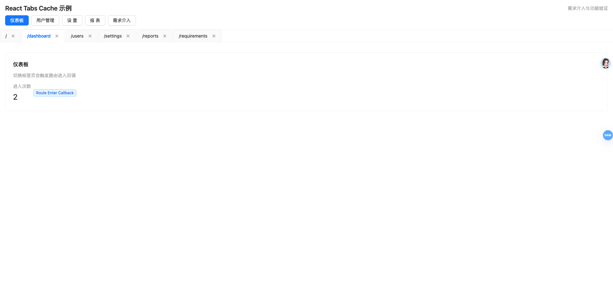
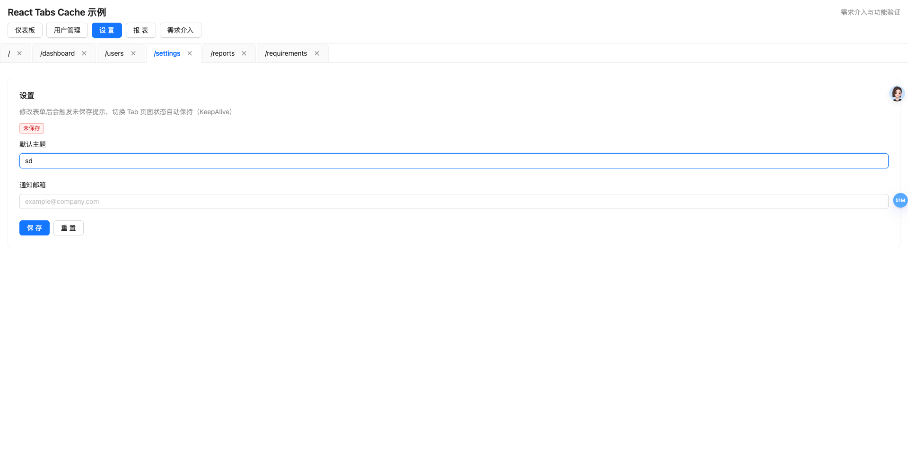

# React Tabs Cache

🚀 一个为 React + Ant Design + React Router 开发的高性能多标签页缓存库。




## 特性

- **真正的状态保持**：基于 React 节点引用缓存，完美保留表单输入、滚动位置和组件内部状态。
- **开箱即用**：深度集成 Ant Design Tabs 和 React Router v6+。
- **性能卓越**：采用 `display: none` 切换，避免重复渲染和挂载。
- **生命周期支持**：提供专为缓存页面设计的进入回调 Hook。
- **轻量解耦**：核心逻辑与 UI 分离，支持高度自定义。

## 开发与示例

如果你想在本地开发或查看示例项目：

```bash
# 克隆仓库
git clone https://github.com/your-repo/@jcyao/react-tabs-cache.git

# 安装依赖
npm install

# 运行示例项目
npm run dev:example
```

关于示例项目的详细功能演示说明，请参考 [快速开始 - 运行示例项目](./docs/QUICK_START.md#运行示例项目)。

## 文档

- [快速开始](./docs/QUICK_START.md) - 3 分钟上手。
- [API 参考](./docs/API.md) - 详细的接口说明。
- [架构设计](./docs/ARCHITECTURE.md) - 深入了解实现原理。
- [生命周期详解](./docs/LIFECYCLE.md) - 掌握标签页切换的底层逻辑。

## 快速预览

```tsx
import { TabsLayout, useRouteSync } from '@jcyao/react-tabs-cache';

// 在布局组件中使用
const Layout = () => {
  useRouteSync(); // 自动同步路由
  return <TabsLayout />;
};

// 在页面组件中使用
const Page = () => {
  useRouteEnterCallback(() => {
    // 每次切换回该标签时执行
  });
  return <form>...</form>;
};
```

## 贡献

欢迎提交 Issue 或 Pull Request。

## 许可证

MIT
