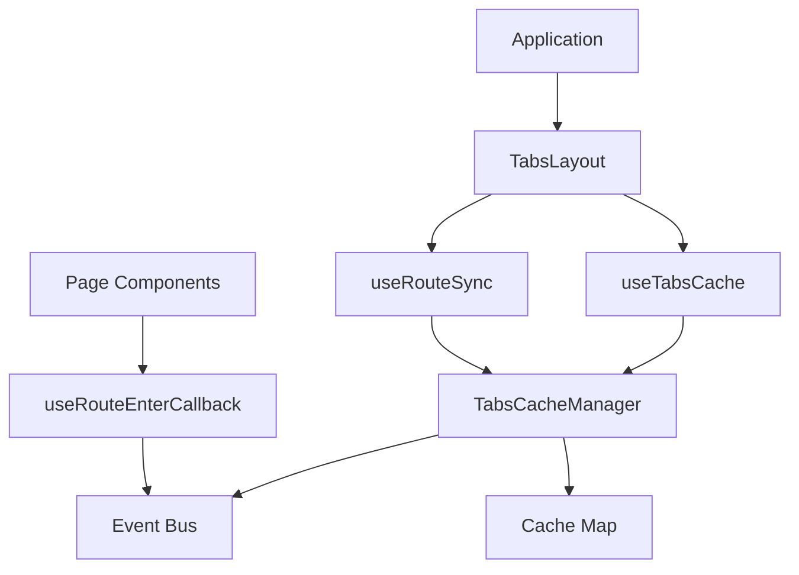

# React Tabs Cache 架构设计

React Tabs Cache 采用事件驱动的架构，旨在为多标签页应用提供高性能、低侵入性的组件状态缓存解决方案。

## 核心设计理念

1.  **无损缓存**：通过保留 React Fiber 节点（使用 `useOutlet` 和 `cachedElement`），实现真正的组件状态保持，包括滚动位置、未提交的表单数据、定时器等。
2.  **事件驱动**：核心管理器 `TabsCacheManager` 通过全局事件总线与 Hooks 通信，确保状态在不同组件间同步。
3.  **路由同步**：与 `react-router-dom` 深度集成，自动根据路由变化同步标签页状态。
4.  **按需生命周期**：提供 `useRouteEnterCallback` 模拟页面进入生命周期，解决缓存页面数据更新问题。

## 系统架构图

## 关键模块

### 1. TabsCacheManager (Core)
核心单例，负责：
- 维护标签页列表 (`tabsMap`, `tabsOrder`)。
- 跟踪活跃标签页 (`activeTabId`)。
- 缓存组件实例 (`cachedElement`)。
- 触发全局事件 (`tab:added`, `tab:activated`, `tab:removed`)。

### 2. useTabsCache (Hook)
对外提供的 API 钩子，封装了 `TabsCacheManager` 的操作，并监听其事件以触发 React 组件重绘。

### 3. useRouteSync (Hook)
自动监听路由变化，根据配置自动创建、激活或关闭标签页。

### 4. TabsLayout (Component)
UI 容器组件，利用 `useOutlet` 获取当前路由对应的 React 元素，并将其交给 `TabsCacheManager` 进行持久化。

## 缓存机制详解

不同于传统的 Redux 或 Context 存储数据，本库采用**实例缓存**：
- 当标签页 A 切换到 B 时，A 的渲染结果（React Element）被保存在 `TabsCacheManager` 的内存中。
- `TabsLayout` 会渲染所有已缓存的标签页，但通过 CSS `display: none` 隐藏非活跃标签。
- 由于 React Element 引用保持不变，React 会复用现有的 Fiber 节点，从而保留所有内部状态。

## 生命周期管理

通过全局事件总线，当标签页激活时，`TabsCacheManager` 会发出 `tab:activated` 事件。`useRouteEnterCallback` 监听该事件，并在目标标签页匹配时执行注册的回调函数，从而实现“页面进入”时的逻辑触发。
