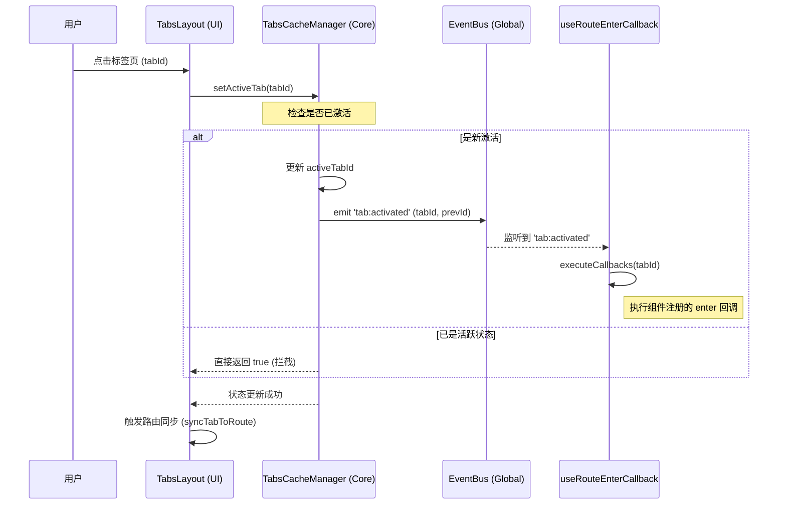
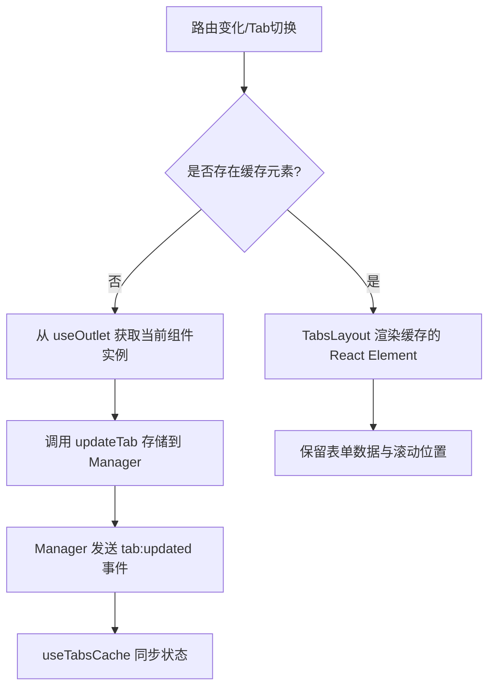
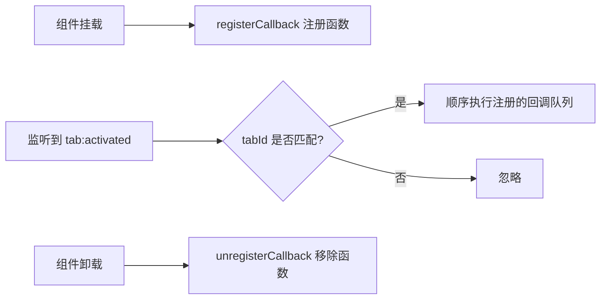

# 标签页生命周期与事件机制文档

本模块采用基于全局事件总线（Event Bus）的响应式架构，确保标签页管理核心、React Hooks 以及 UI 组件之间能够高效、解耦地同步状态。

## 1. 核心概念

- **TabsCacheManager (Core)**: 状态的唯一真理来源，负责维护标签页列表、活跃 ID 和缓存策略。
- **Global Event Bus (Utils)**: 信息的传递枢纽，解耦了状态变更与副作用执行。
- **useTabsCache (Hook)**: 状态同步器，监听事件总线并将核心状态映射到 React 组件状态。
- **useRouteEnterCallback (Hook)**: 生命周期增强器，允许组件在“逻辑进入”页面时执行特定回调。

---

## 2. 核心事件流

系统定义了以下关键事件，驱动整个生命周期：

| 事件名称 | 触发时机 | 主要订阅者 | 作用 |
| :--- | :--- | :--- | :--- |
| `tab:added` | 新标签页被创建并添加到列表时 | `useTabsCache` | 更新全局标签页列表状态 |
| `tab:activated` | 活跃标签页发生切换时 | `useTabsCache`, `useRouteEnterCallback` | 触发 UI 切换及路由进入回调 |
| `tab:removed` | 标签页被关闭时 | `useTabsCache` | 清理内存缓存与持久化数据 |
| `tab:updated` | 标签页元数据（如标题、缓存元素）变更时 | `useTabsCache` | 确保 UI 与缓存实例同步 |

---

## 3. 关键流程可视化

### 3.1 标签页切换流程 (Tab Switching)

当用户点击一个非活跃标签页时，整个系统的协作流程如下：

---

### 3.2 页面缓存捕获流程 (Keep-Alive Capture)

本库通过 `useOutlet` 捕获 React Fiber 节点，实现真正的 DOM 与状态保持。

---

### 3.3 路由进入回调流程 (Route Enter Callback)

`useRouteEnterCallback` 解决了在 Tab 缓存模式下，标准 `useEffect` 只在首次挂载时执行的问题。

---

## 4. 设计细节说明

### 4.1 事件幂等性
在 `TabsCacheManager` 的 `setActiveTab` 中，我们增加了对 `previousTabId === tabId` 的判断。这确保了即使 UI 层（如点击事件）和路由层（如浏览器后退）同时触发激活操作，全局也只会发送一次 `tab:activated` 事件。

### 4.2 弱关联缓存
`TabsLayout` 监听 `outlet` 的变化。当路由对应的 React 元素发生变化时，它会自动捕获并更新缓存。通过 `updateTab` 更新 `cachedElement` 不会触发整个 Tab 列表的全量重绘，而是利用 React 的引用一致性来保持组件状态。

### 4.3 监听器清理
所有 Hook 在 `useEffect` 的返回函数中都严格执行了 `unsubscribe()`，防止内存泄漏和事件在已销毁组件中错误触发。
